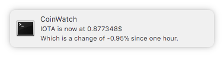

# Coinwatch

This is a daemon that checks the ticker for configured cryptocurrencies and notifies you about their current worth.



## Features

- Polls current currency info from coinmarketcap.com
- Displays a notification for each poll and each currency with configurable delays
- A click on the notification opens the selected currency in the default browser
- Daemonized. Once you started it, you can kill your shell and it will remain running.
- Should work on Windows, macOS (tested) and Linux.

## Usage

0. `npm i`
1. Configure your currencies in `config.js`. Example: `currencies: ['monero', 'fantomcoin']`
2. Start the daemon: `$ node index.js`

### Killing the daemon

You will like this one. 🙃

```
kill -9 $(ps aux | grep coinwatch/index.js | awk '{print $2}')
```

Since I have no idea how to properly get the PID without creating a temp file to push the data around I decided to just use a bash chain to kill the daemon.

Here's what the command does:

1. `ps aux` prints out all running processes (with great detail)
2. `grep coinwatch/index.js` just filters out every line containing the `"coinwatch/index.js"` string (When only one daemon is running, it will find two lines, where one of them is the process for grep itself)
3. `awk '{print $2}'` picks out the second "column" which is the PID in the case of `ps aux`
4. `kill -9` sends `SIGKILL` to the specified processes. Since the grep process has finished by now, it will print one `no such process` error and kill only the daemon.

Isn't this a nice workaround? :)

I also tried adding this as `npm stop` script, but it fails to find the PID somehow. Dunno, Duncare.